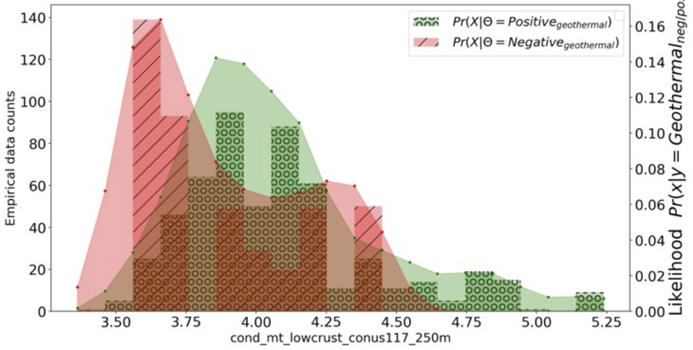
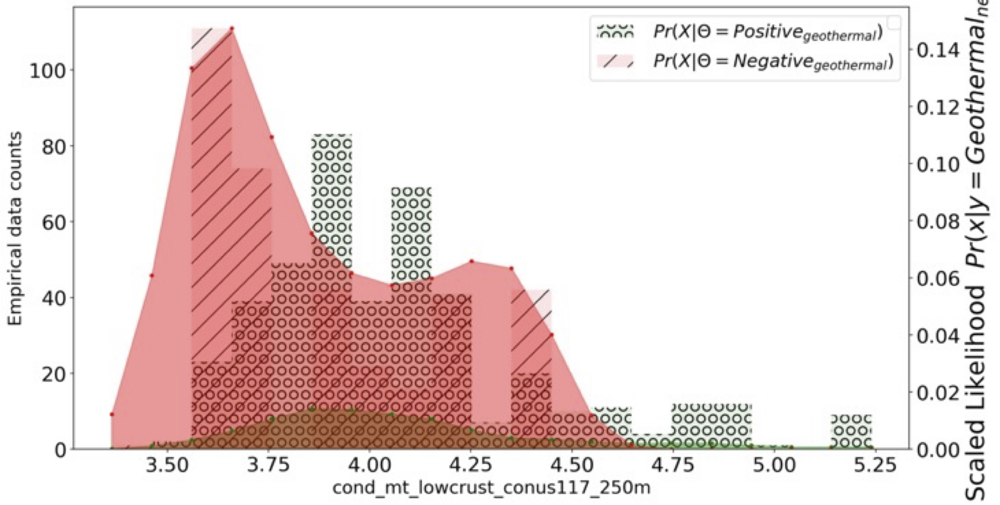
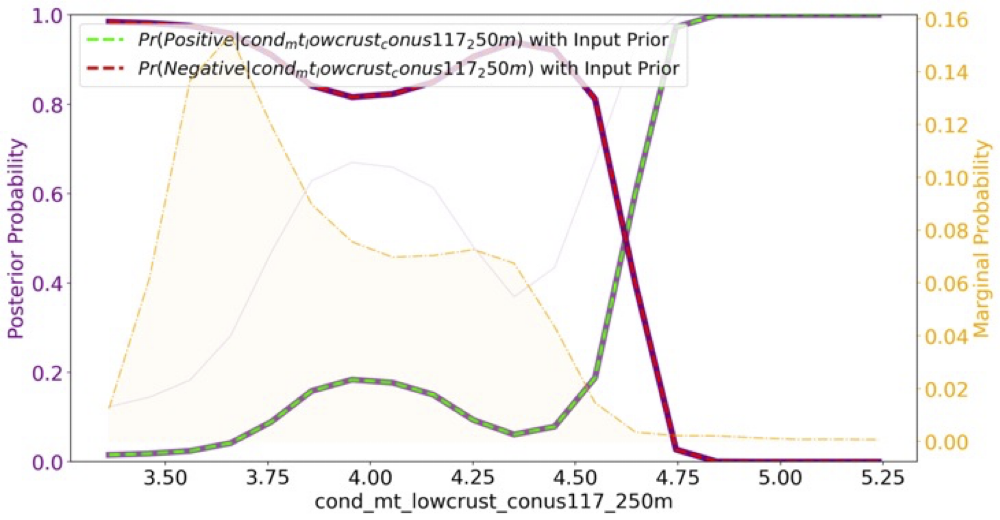

# Summary

The Geothermal VOI App reveals which data types best distinguish between a 
hidden conventional geothermal resource and no geothermal resource. Hidden 
geothermal resources are geothermal resources that do not show any evidence
of existence on the surface, thus geophysical and geological observations 
are used to make estimates of subsurface conditions. None of the the data 
layers are direct evidence of heat, permeability and fluids, therefore 
they are imperect indicators [@faulds_discovering_2015]. The value of information (VOI) metric 
attempts to quantify how useful specific information types are
by quantifying their reliability and how it may help or hinder with decisions [@howard_information_1966]. 
VOI is from the field of decision analysis and assess if the information will
improve the average outcome of a decision made under uncertainty, like
developing a hidden geothermal resource.

# Statement of need

Many geoscientists working in geothermal do not actively code and those outside 
of oil and gas are not familiar with decision analysis. This VOI Streamlit
 App allows geoscientists to visualize the distribution of their data and calculate
 the value of imperfect (real!) data simply by upload two comma-seperated value (.csv) files. 
 These two files represent calibrated data set: data assosciated with a positive and negative hidden geothermal
  sites, respectively.

# Mathematics

Decision Analysis requires an analysis of the expected outcome (e.g. weighted average) 
of the decision without further information. This uses the probabilities of positive $Pr(\Theta = positive)$ and negative $Pr(\Theta = negative)$
hidden geothermal as the weights multiplied by the value outcomes: $v_a(\Theta = \theta_i)$, the values input into the two by two table that typically represent dollar amounts.   
 $V_{prior} = \max\limits_a \sum_i^2 Pr(\Theta = \theta_i) v_a(\Theta = \theta_i)$
<!-- The prior probability $Pr(\Theta = \theta_i)$ where there are two $\theta_i)$:  $i ={negative, positve}$ -->
Also calculated is the Value with Perfect Information:   
 $V_{perfect} = \sum_i^2 Pr(\Theta = \theta_i) \max\limits_a v_a(\Theta = \theta_i)$
  <!-- \Sigma_{i=1}^2 Pr(\Theta = \theta_i) \max\limits_a v_a(\theta_i) \ \  \forall a  -->
comparing to $V_{prior}$ gives an upper bound on what *any* information could bring or the value *of* perfect information ($VOI_{perfect}$): \
$VOI_{perfect} = V_{perfect}- V_{prior}$

After the .csv files are uploaded, the code base performs a grid search on bin sizes ($x_j$) or kde bandwidths, as documented in @trainor-guitton_voi_2023. To determine the "best" bandwidth, the data are split into training and testing sets, and the accuracy of Naïve Bayes classifier is evaluated . The grid search performs the Naïve Bayes classification for 20 different bandwidths then compares the predicted class with the true class.  The bandwidth that results in the highest accuracy in Naïve Bayes is deemed the ideal bandwidth.

Next, the VOI App calculates the posterior probability: 
<!-- Double dollars make self-standing equations: -->
$$Pr( \Theta = \theta_i | X =x_j ) = \color{cyan} \frac{Pr(\Theta = \theta_i ) 
\color{purple} Pr( X=x_j | \Theta = \theta_i )}{\color{orange} Pr (X=x_j)}$$ \
which scales the "ideal" likelihood from the grid search with the user-entered prior probability of success ($\Theta = \theta_i$).
The posterior replaces the prior to become the weight in the value *with* imperfect information: \
$V_{imperfect} = \sum_{j=1}^2 Pr(X = x_j) \max_a \sum_{i=1}^2  Pr(\Theta = \theta_i | X=x_j)  v_a(\Theta = \theta_i)$

This value tells user the ceiling of worth for this data attribute, given the economics and prior probability entered, and the reliability of the data to discriminate between a positive and negative geothermal case.

# Example Output 
The demo problem allows users to build intuition on how $V_{prior}$ and $V_{perfect}$.

This figure provides a visual example of the empirical likelihood (bars) of the electrical conductivity assosciated with 
positive sites (green) and negative sites (red): 
{ width=50% } 

\includegraphics[width=0.7\textwidth,height=\textheight]{Likelihood_CondLowCrust.png}

The continuous lines in \autoref{fig:Likelihood_CondLowCrust.png} are the fitted kde likelihoods of the optimal bandwidth given the grid search for accuracy in Naïve Bayes. The likelihood scaled to a prior probability of success ($Pr(\Theta = positive$)=0.2) 
{width=50%} 

The posterior plot of $Pr(\Theta = positive$)=0.2 are shown below
{ width=50% } 

# Acknowledgements
We acknowledge contributions from Sierra Rosado during the genesis of this project and from Nicole Taverna for providing feedback. 
We also acknowledge Drew Siler, Andres Laverde, and Gabe Matson for providing case histories using the VOI App for the Geothermal Rising VOI Workshop 2024.

# References
 J. E. Faulds et al., “Discovering Blind Geothermal Systems in the Great Basin Region : An Integrated Geologic and Geophysical Approach for Establishing Geothermal Play Fairways,” 2015. [Online]. Available: https://gdr.openei.org/files/756/Faulds-DE-EE0006731-Report-v2.pdf

Howard, R. a. (1966). Information Value Theory. <i>Systems Science and Cybernetics, IEEE Transactions On</i>, <i>2</i>(1), 22–26. https://doi.org/10.1109/TSSC.1966.300074

Trainor-Guitton, W., & Rosado, S. (2023). A VOI Web Application for Distinct Geothermal Domains: Statistical Evaluation of Different Data Types within the Great Basin. 1836-1851. Paper presented at Geothermal Rising, Reno, Nevada. https://www.geothermal-library.org/index.php?mode=pubs&action=view&record=1034920

VanderPlas, Jake. 2016. Python Data Science Handbook: Essential Tools for Working with Data. First edition. Python / Data. Beijing Boston Farnham Sebastopol Tokyo: O’Reilly.